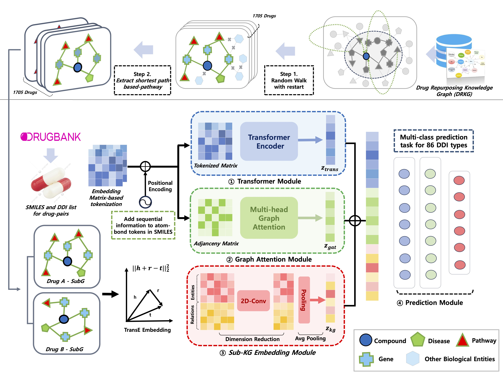

⸻

# TRACE-DDI

**TRACE-DDI** is a Transformer–GAT hybrid framework for **drug–drug interaction (DDI) prediction**.  
It integrates **SMILES-based Transformer encoders**, **graph attention networks (GAT)**, and **pre-computed compound vectors** (e.g., knowledge-graph embeddings).

⸻

## Workflow Overview

<p align="center">
  
</p>

*Figure: End-to-end TRACE-DDI pipeline overview.*

⸻

---

## Environment Setup

**Requirements**
- Python ≥ 3.9 (tested on 3.10–3.12)
- PyTorch ≥ 2.1 (CUDA recommended)
- PyTorch Lightning ≥ 2.0
- scikit-learn, pandas, numpy, matplotlib
- *(Optional)* `pynvml` for GPU monitoring

---

## Data Format

See `/preprocessing` for preprocessing scripts and format specifications.  
Each data file (TSV/CSV) must include aligned drug identifiers across SMILES and embedding tables.

---

## Repository Structure

```bash
repo-root/
│
├── trace-ddi.py                  # Main launcher
└── utils/
    ├── __init__.py
    ├── data.py                   # Data loading, tokenization, adjacency, dataset
    ├── model.py                  # Transformer, GAT, and classifier modules
    └── train_eval.py             # Stratified K-Fold training, evaluation, saving


⸻

Best-Parameter Command

python trace-ddi.py \
  --num_epochs 100 \
  --batch_size 32 \
  --lr 2.831e-05 \
  --log_dir path/to/your/result_TRACE/log/ \
  --model_save_dir path/to/your/result_TRACE/savedModel/ \
  --result_dir path/to/your/result_TRACE/ \
  --ddi_data_path path/to/your/data/ddi.tsv \
  --smiles_data_path path/to/your/data/smiles.tsv \
  --compound_vector_path path/to/your/data/vec20_conv.csv \
  --embedding_dim 256 \
  --d_model 128 \
  --nhead 8 \
  --num_encoder_layers 6 \
  --dim_feedforward 3072 \
  --hidden_dim 256 \
  --classifier_dropout 0.05 \
  --gat_dropout 0.0107 \
  --gat_alpha 0.3738

Notes
	•	Use --nhead (not --num_heads) for multi-head attention.
	•	Tensor Core GPUs (e.g., RTX 4090) automatically set torch.set_float32_matmul_precision('high').
	•	All logs, checkpoints, and reports are saved per fold under the specified directories.

⸻

Key Arguments
	•	--num_epochs: Number of training epochs (default: 100)
	•	--batch_size: Batch size (default: 32)
	•	--lr: Learning rate (default: 0.00076)
	•	--log_dir: Directory for logs and plots (default: ./logs/)
	•	--model_save_dir: Directory for checkpoints (default: ./saved_models/)
	•	--result_dir: Directory for evaluation reports (default: ./results/)
	•	--ddi_data_path: Path to DDI TSV (required)
	•	--smiles_data_path: Path to SMILES TSV (required)
	•	--compound_vector_path: Path to compound vector CSV (required)
	•	--embedding_dim: SMILES embedding dimension (default: 64)
	•	--d_model: Transformer model dimension (default: 128)
	•	--nhead: Number of attention heads (default: 4)
	•	--num_encoder_layers: Number of Transformer encoder layers (default: 3)
	•	--dim_feedforward: Feed-forward (FFN) dimension (default: 512)
	•	--hidden_dim: Hidden dimension of classifier (default: 256)
	•	--classifier_dropout: Dropout rate in classifier head (default: 0.0)
	•	--gat_dropout: Dropout rate in GAT layer (default: 0.0145)
	•	--gat_alpha: Negative slope of GAT LeakyReLU (default: 0.3086)
	•	--case_sensitive: Preserve case in SMILES tokens (default: off)
	•	--n_splits: Number of cross-validation folds (default: 5)

⸻

Pipeline Overview
	1.	Logging & Reproducibility
	•	Logging initialized at INFO level; random seeds fixed.
	2.	Data Preparation (utils/data.py)
	•	Load DDI and SMILES tables.
	•	Encode interaction labels.
	•	Tokenize SMILES using regex-based tokenizer.
	•	Construct fixed-size adjacency matrices.
	3.	Model Composition (utils/model.py)
	•	Transformer encoder for SMILES.
	•	Multi-head GAT with decayed sinusoidal positional embedding.
	•	Combine SMILES, GAT, and compound vectors → classification head.
	4.	Training & Evaluation (utils/train_eval.py)
	•	Stratified K-Fold split (default: 5 folds).
	•	Label distribution visualization per fold.
	•	EarlyStopping & ModelCheckpoint based on val_acc.
	•	Save checkpoints and evaluation reports per fold.

⸻

Example Outputs

result_TRACE/
├── log/
├── savedModel/
└── results_fold1.txt

Each results_foldk.txt includes:
	•	Accuracy, Precision, Recall, and F1 (weighted average)
	•	Full classification_report from scikit-learn

⸻

Tips & Troubleshooting
	•	Ensure consistent drug IDs across ddi_*.tsv, smiles_*.tsv, and vec*.csv.
	•	For large datasets, increase num_workers in DataLoader.
	•	Ignore harmless torchmetrics pkg_resources warnings.
	•	Monitor GPU memory and utilization with pynvml.

⸻